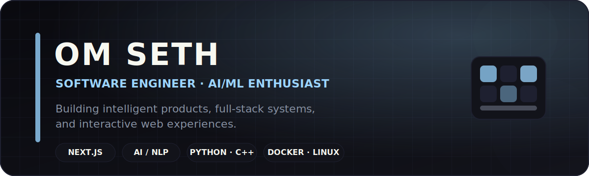

  

  
  
  
  

<h2 align="center">Building intelligent software with thoughtful engineering and interactive design.</h2>

  Final-year B.Tech ECE student at IIIT Surat, software developer, and AI/ML enthusiast. 
  I build full-stack products, NLP systems, developer tools, and reliable cloud-deployed experiences.

---

## About Me

- **Software engineering:** React, Next.js, TypeScript, REST APIs, databases, Docker, Linux, and cloud deployment.
- **AI/ML:** NLP pipelines, semantic matching, skill extraction, model-assisted workflows, and LLM data evaluation.
- **Problem solving:** 1,500+ algorithmic problems solved across competitive-programming platforms.
- **Engineering style:** I enjoy owning work from planning and architecture through implementation, testing, debugging, and deployment.
- **Open to:** Software-engineering internships, AI/ML opportunities, open-source collaboration, and technically ambitious projects.

## Currently

<table>
<tr>
<td width="50%" valign="top">

### Working On

- Improving full-stack AI products
- Building reliable evaluation and testing workflows
- Strengthening system design and backend engineering
- Creating polished, accessible interactive interfaces

</td>
<td width="50%" valign="top">

### Learning More About

- Production AI/ML systems
- Distributed and event-driven architecture
- Cloud infrastructure and observability
- Open-source engineering practices

</td>
</tr>
</table>

## Featured Work

<table>
<tr>
<td width="50%" valign="top">

### Interactive Developer Portfolio

A responsive Next.js portfolio featuring a 24-key Spline/WebGL skill keyboard, GSAP interactions, project filtering, theme support, and an animated avatar.

**Stack:** Next.js · TypeScript · Tailwind CSS · GSAP · WebGL

[Live website](https://om-seth-portfolio.vercel.app/) · [Source code](https://github.com/oomnii/Portfolio-Codebase)

</td>
<td width="50%" valign="top">

### Smart Hiring & Resume Scoring

A full-stack candidate and recruiter platform with resume upload, application tracking, semantic job matching, skill extraction, missing-skill analysis, and candidate ranking.

**Stack:** React · FastAPI · Python · NLP · AI/ML

[Source code](https://github.com/oomnii/Smart-Hiring-and-Resume-Scorer)

</td>
</tr>

<tr>
<td width="50%" valign="top">

### Voronoi WSN Scheduler

A wireless-sensor-network simulator with Voronoi scheduling, backup-node selection, fault recovery, analytics dashboards, and reproducible Docker deployment.

**Stack:** React · Flask · Python · Machine Learning · Docker

[Live website](https://voronoi-wsn-scheduler.onrender.com/) · [Source code](https://github.com/oomnii/Energy-Efficient-Node-Scheduling-with-AI-Driven-Optimization)

</td>
<td width="50%" valign="top">

### ABHYAAS Examination Portal

An online examination platform designed for quiz delivery and result workflows, building on experience running a live quiz system for 140+ concurrent students.

**Stack:** JavaScript · HTML · CSS · Web Application Design

[Source code](https://github.com/oomnii/ABHYAAS-OnlineExam-Portal)

</td>
</tr>
</table>

## Technical Toolkit

### Languages

  

### Frontend and Interaction

  

### Backend, Data, and Infrastructure

  

### Developer Tools

  

## Experience

### AI Data Training Specialist — XelronAI

- Evaluated multi-domain prompt-response data used for LLM training through factual verification, instruction-adherence checks, and rubric-based review.
- Collaborated on difficult edge cases and evaluation-guideline improvements.
- Converted complex requirements into repeatable quality checks and clear documentation.

## Competitive Programming and Achievements

<table>
<tr>
<td align="center"><strong>1,500+</strong> Problems solved</td>
<td align="center"><strong>1992</strong> LeetCode peak rating</td>
<td align="center"><strong>1427</strong> Codeforces peak rating</td>
<td align="center"><strong>Top 1.6%</strong> LeetCode Weekly 510</td>
</tr>
</table>

- **LeetCode:** Knight, peak rating **1992**
- **Codeforces:** Specialist, peak rating **1427**
- Ranked **606th among 40,000+ participants** in LeetCode Weekly Contest 510.
- Winner of the **AI Prompt Engineering Competition** at GDG Indore.
- Designed and self-hosted a live quiz platform serving **140+ concurrent students with zero downtime**.

  
  

## GitHub Analytics

  

  

## Interests and Hobbies

- Competitive programming and algorithmic problem solving
- Interactive UI engineering, 3D experiences, and web animation
- AI/ML experimentation and evaluation systems
- Linux, Docker, self-hosting, and developer infrastructure
- Electronics, wireless sensor networks, and practical engineering systems

## Future Build Queue

- A production-grade AI evaluation and observability platform
- A distributed background-job and workflow orchestration system
- An open-source developer analytics dashboard
- A hardware-software project connecting edge devices with cloud intelligence

## Connect

  <strong>Have an engineering opportunity, open-source idea, or difficult product problem?</strong>

  <a href="mailto:sethomni1564@gmail.com">Email</a>
  ·
  <a href="https://www.linkedin.com/in/om-seth-94ab523b9/">LinkedIn</a>
  ·
  <a href="https://om-seth-portfolio.vercel.app/">Portfolio</a>
  ·
  <a href="./assets/Om-Seth-Resume.pdf">Resume</a>

  Designed to match the visual system of the Om Seth portfolio.

